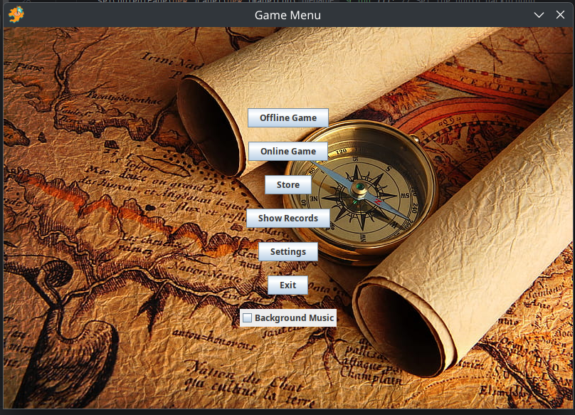
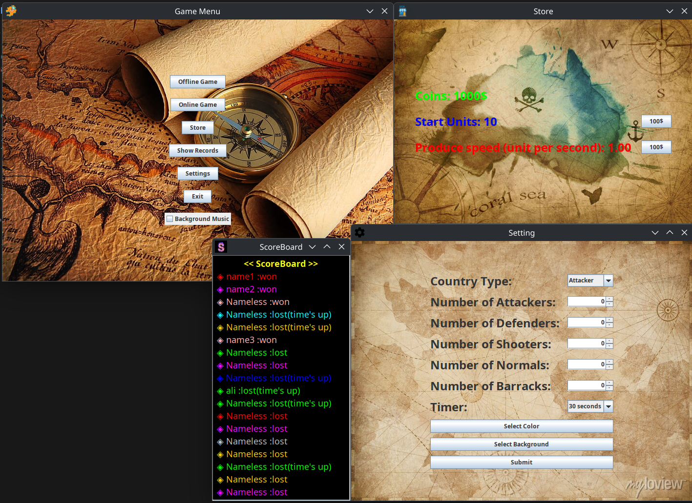
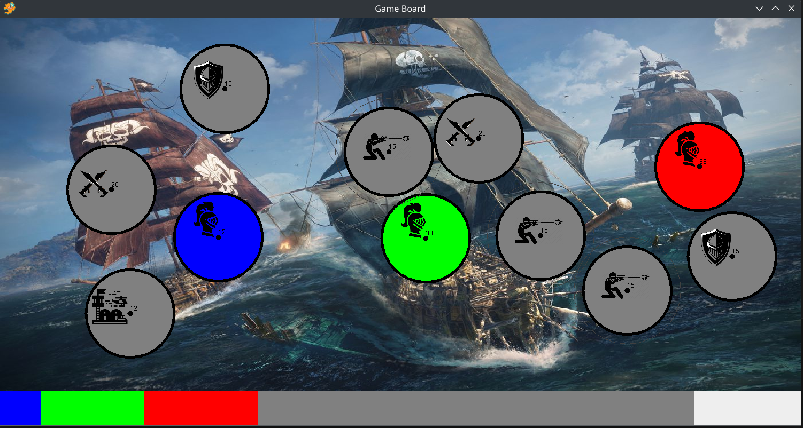

# Country-Conquest-Game-Advanced-Programming-Project-5

This project is a strategic, real-time **country conquest game**, inspired by *State.io - Conquer the World*. The game is implemented in Java and supports  **offline multiplayer** gameplay using random world maps.

The main goal is to **conquer all enemy territories** and become the last remaining state. Players start with one country and expand by strategically sending units to neighboring territories.

## 🕹️ Game Mechanics

### ⚙️ Core Features

* 🌍 **Random Map Generation**: Countries are placed randomly on the game board.

* 🧠 **AI or Offline Play**: Support for offline AI or Player opponents.

* 🎨 **Color Selection**: Players can choose from 3 default colors to represent their states.

* ⏱️ **Game Timer Options**:

  * 30 seconds
  * 1 minute
  * 2 minutes
  * Unlimited (default mode)
  * *Capturing certain countries may add bonus time!*

* 📈 **Score History**: Players can view their game score history.

---

### 🛡️ Country Types

Each country can be one of the following types, affecting its behavior and strategy:

* 🧱 **Defensive**
* ⚔️ **Aggressive**
* 🏹 **Sniper**
* ⚙️ **Neutral (Default)**

---

### ⚔️ Conquest Rules

* Each player starts with **one country** and equal power across all countries.
* To capture a target country, the attacker must send units **greater than** the target's defense.
* If successful, the excess units are added to the newly captured country.
* Not all countries are capturable from the start — some may require strategic buildup.
* Enemy players are eliminated once all their countries are captured.

# Pictures

# Team members:

https://github.com/BehrazFS  
https://github.com/Pooria82
